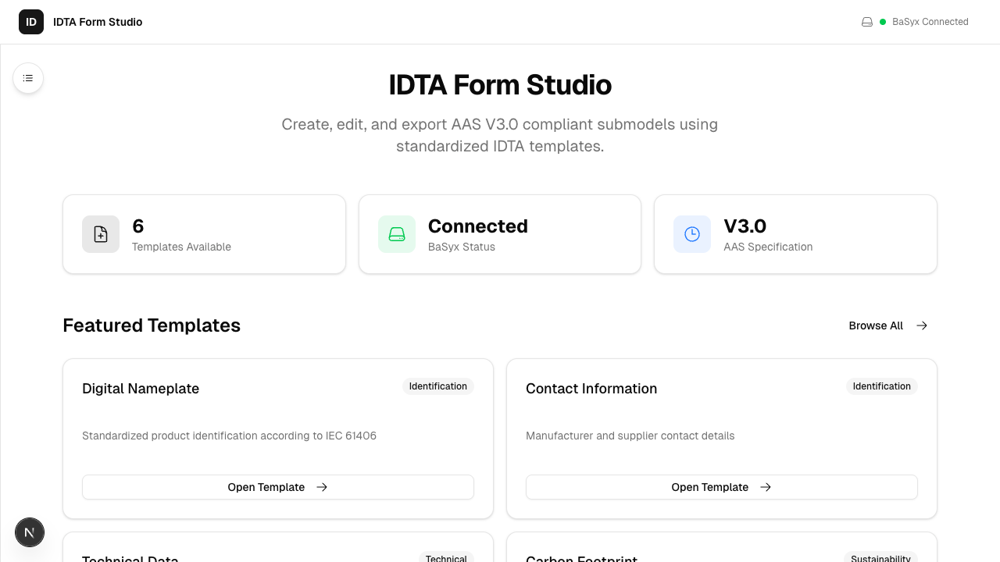
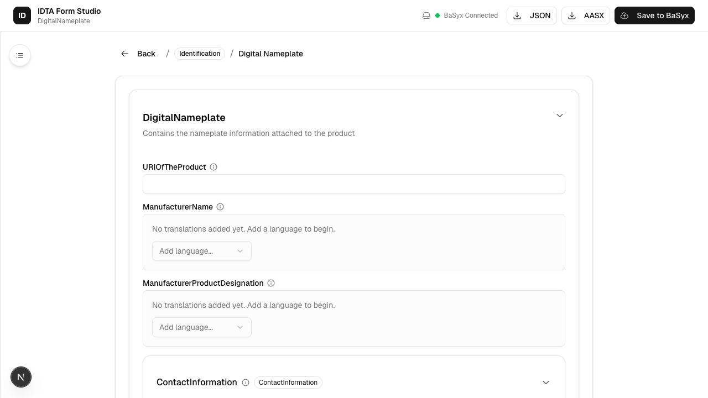
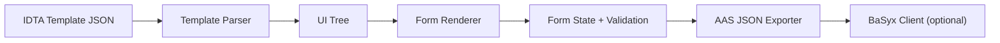

# AAS Form Factory


Dynamic form generation for IDTA Submodel Templates with Asset Administration Shell (AAS) v3.0 JSON output.

## What this app does

If you have an official IDTA Submodel Template (JSON), AAS Form Factory turns it into a working form you can fill out, validate, and export as a proper AAS Submodel Instance. It understands cardinality, value types, multilingual fields, and optional BaSyx storage.

Use it to:
- Rapidly generate forms for IDTA templates
- Validate values as you type
- Export AAS JSON that conforms to Spec Part 1 v3.0
- Create/update submodels in BaSyx (optional)

## Screenshot walkthrough (5 tiles)

<table>
  <tr>
    <td>
      
      <br>Home (template list)
    </td>
    <td>
      
      <br>Template form
    </td>
    <td>
      
      <br>Add language
    </td>
  </tr>
  <tr>
    <td>
      
      <br>File upload
    </td>
    <td>
      
      <br>Export actions
    </td>
    <td></td>
  </tr>
</table>

## Visual walkthrough (UI map + flow)

### Screen layout (mental model)

```text
┌──────────────────────────────────────────────────────────────┐
│ IDTA Form Studio         JSON   AASX   Save to BaSyx          │
├───────────────┬──────────────────────────────────────────────┤
│ Templates     │ Form (dynamic sections + fields)             │
│ - Nameplate   │ - Section header                              │
│ - Technical   │   - Field label    [input]  (errors here)     │
│ - Carbon      │   - Multi-language  [+ Add language]          │
│ ...           │   - Array item      [+ Add item]              │
│               │   - File input      [Upload]                  │
└───────────────┴──────────────────────────────────────────────┘
```

### 6-step walkthrough

1) Pick a template  
   Open the app and choose a template from the left sidebar.

2) Fill the generated form  
   Fields appear based on the template structure. Required fields are marked and validated.

3) Add multi-language values  
   Use “Add language” to add translations for multi-language properties.

4) Add array items or nested elements  
   For OneToMany/ZeroToMany, you can add or remove items dynamically.

5) Upload files (when the template uses File elements)  
   The UI accepts files and keeps metadata for export.

6) Export or Save  
   Export as JSON or send to BaSyx if configured.

## How it works (data flow)



## Key features

- Parse IDTA Submodel Templates and extract all SubmodelElements
- Render all 13 AAS SubmodelElement types
- Enforce cardinality (One, ZeroToOne, OneToMany, ZeroToMany)
- Validate inputs against XSD valueTypes (xs:string, xs:integer, xs:anyURI, xs:date, etc.)
- Export valid AAS JSON (Spec Part 1 v3.0) with schema validation
- Multi-language properties with add/remove language entries
- Optional BaSyx integration for create/read/update

## Supported templates

| Template | IDTA ID |
|----------|---------|
| Digital Nameplate | IDTA 02006-2-0 |
| Contact Information | IDTA 02002-1-0 |
| Technical Data | IDTA 02003-1-2 |
| Handover Documentation | IDTA 02004-1-2 |
| Carbon Footprint | IDTA 02023-1-0 |

## Quick start

See `QUICKSTART.md` for a 5‑minute setup.

```bash
pnpm install
pnpm dev
```

Open http://localhost:3000

## Everyday tasks

```text
Export JSON:   Click "JSON" to download a Submodel Instance.
AASX export:   Out of scope for v1.0 (button may appear but is not supported).
Save to BaSyx: Click "Save to BaSyx" to POST the submodel (requires BaSyx running).
```

## Scripts

```bash
pnpm dev             # Start dev server
pnpm lint            # ESLint
pnpm type-check      # TypeScript strict check
pnpm test            # Vitest (watch)
pnpm test:ci         # Vitest (run once)
pnpm test:coverage   # Coverage report
pnpm test:e2e        # Playwright end-to-end tests
pnpm test:a11y       # Playwright a11y checks
pnpm test:responsive # Playwright responsive checks
```

## BaSyx integration

Start BaSyx via Docker Compose:

```bash
docker compose -f docker/docker-compose.yml up -d
```

Integration test (requires BaSyx running):

```bash
BASYX_INTEGRATION=1 pnpm vitest run -- src/lib/api/basyx-client.integration.test.ts
```

## Environment variables

```bash
BASYX_REGISTRY_URL=http://localhost:4000
BASYX_ENVIRONMENT_URL=http://localhost:4001
```

## Project structure

```
src/
├── app/                    # Next.js routes
├── components/             # UI + form components
├── lib/
│   ├── api/                # BaSyx client
│   ├── exporters/          # AAS JSON export
│   ├── importers/          # Submodel instance import
│   ├── parser/             # Template parser
│   └── renderer/           # Form renderer + validation
└── types/                  # AAS v3.0 types
```

## Validation behavior (friendly notes)

- **Cardinality** controls whether a field is required or repeatable.
- **Value types** follow XSD rules (e.g., date, integer, anyURI).
- Errors show inline and block export until corrected.

## Documentation

- `QUICKSTART.md` - 5‑minute setup
- `DEVELOPER_GUIDE.md` - architecture + extension guide
